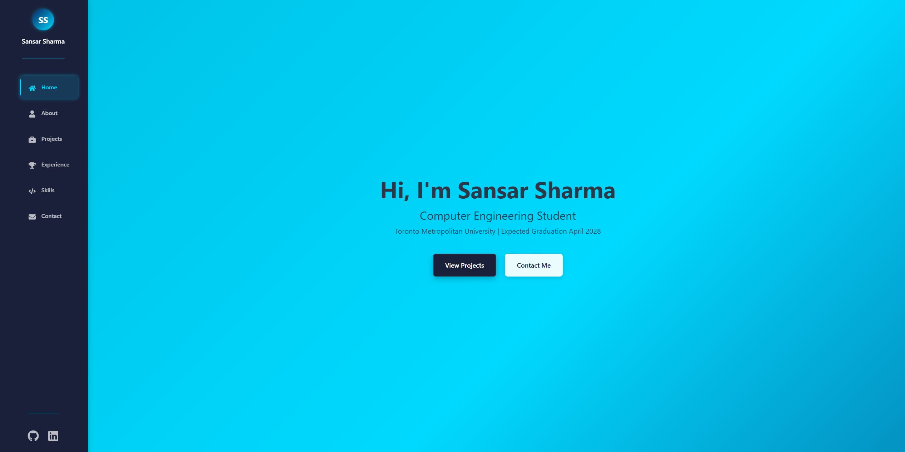
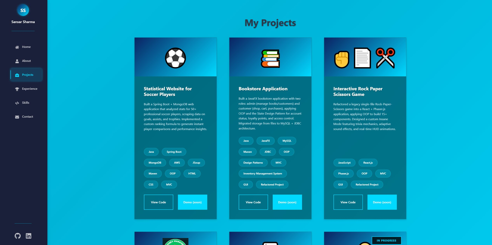
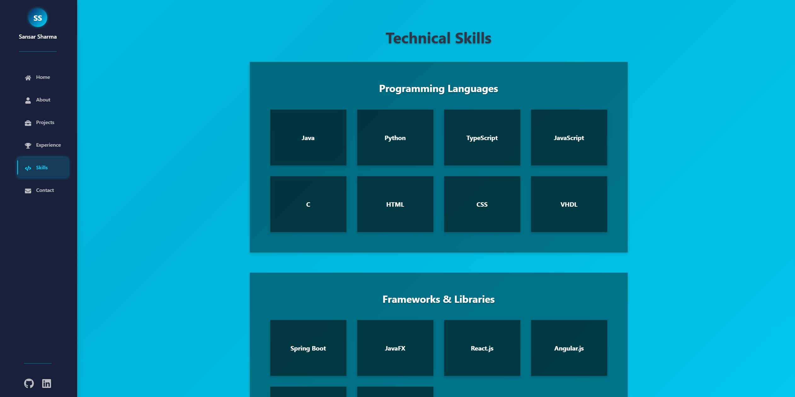
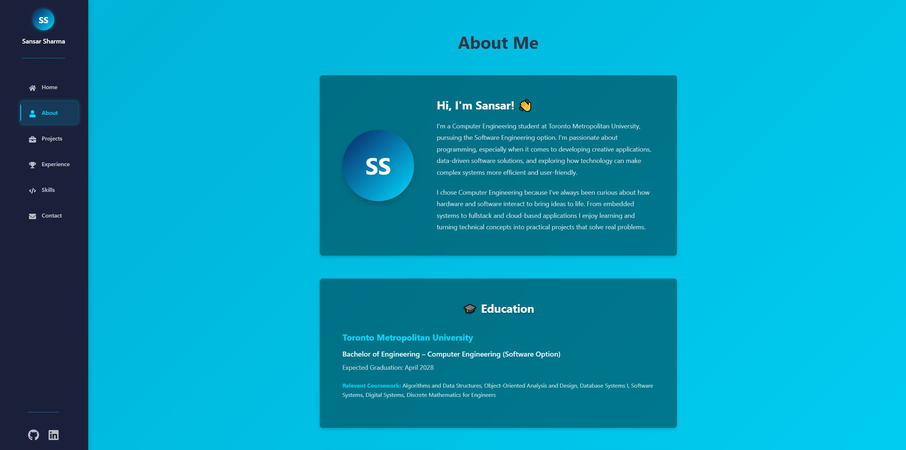
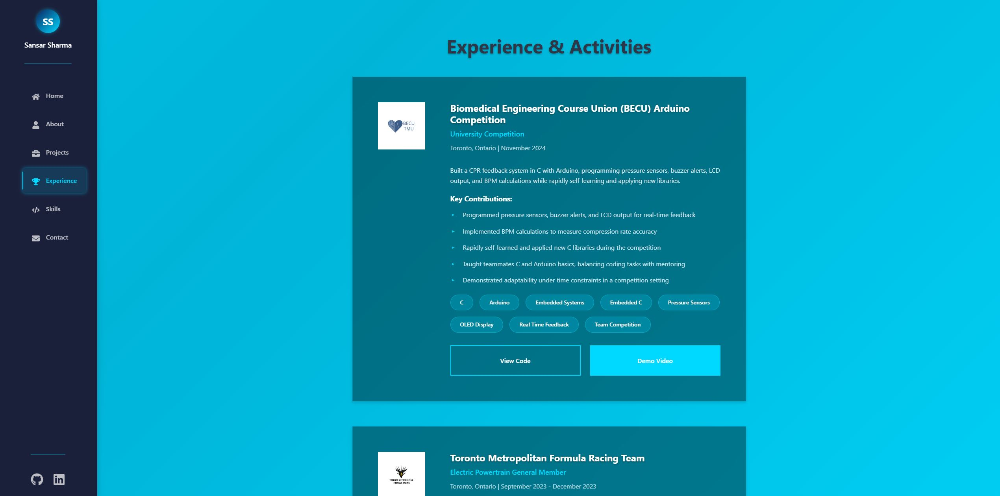
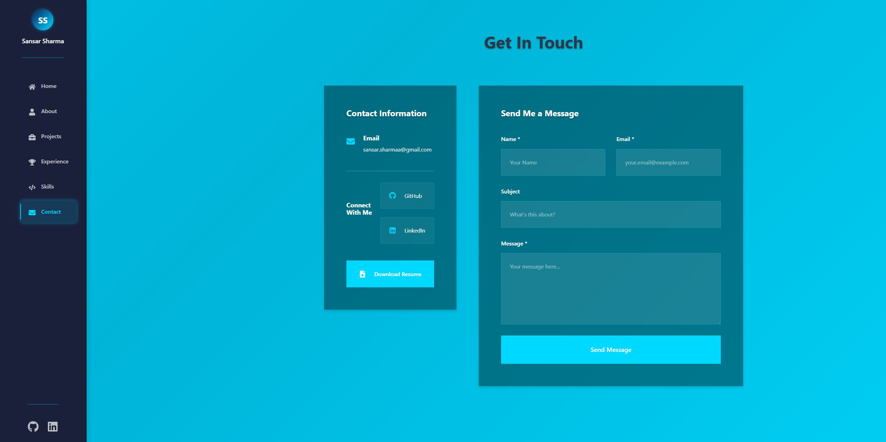

# Portfolio Website

This portfolio website was built to showcase my projects, skills, and development journey as I continue growing as a computer engineer. After working on several full-stack, desktop, and game development projects, I realized I needed a centralized place to present my work in a clean and professional way.

I chose React for this project because I wanted full control over the design and component structure, while applying what I’ve learned about scalable front-end architecture. I also integrated EmailJS so visitors can reach me directly through the site, eliminating the need for a backend server. Whether someone wants to browse the deployed website or explore the source code locally, this portfolio serves as a technical reflection of who I am as a developer today, and who I’m working to become.

---

## Table of Contents
- [Live Demo](#live-demo)
- [Features](#features)
- [Technologies Used](#technologies-used)
- [File Structure](#file-structure)
- [Screenshots](#screenshots)
- [Requirements](#requirements)
- [How to Run](#how-to-run)
- [Notes](#notes)

---

## Live Demo
link

---

## Features
- Responsive layout with SCSS and a consistent design system
- Sidebar navigation with multi-page routing using React Router
- EmailJS integration for contact form submission without a backend
- Clean and modular file organization for readability and scalability
- Bootstrap overrides for custom theme control
- Screenshots included for quick project preview

---

## Technologies Used
- React.js: Component-based UI development

- React Router: Client-side routing

- Bootstrap: Responsive layout foundation

- SCSS: Modular styling with variables and mixins

- EmailJS: Client-side email service for contact form

- JavaScript (ES6+): Core language features and application logic

---

## File Structure

- `src/components`
  - `Navbar/Navbar.jsx`: Sidebar navigation component
  - `Navbar/Navbar.scss`: Styling for the navigation component

- `src/pages`
  - `HomePage/HomePage.jsx`: Landing page with introduction and call-to-action buttons
  - `AboutPage/AboutPage.jsx`: Background, education, and interests
  - `ProjectsPage/ProjectsPage.jsx`: Project showcase
  - `ExperiencePage/ExperiencePage.jsx`: Extracurricular and professional experience
  - `SkillsPage/SkillsPage.jsx`: Technical skills with interactive flip cards
  - `ContactPage/ContactPage.jsx`: EmailJS-powered contact form
  - Each page includes a corresponding `.scss` file

- `src/styles`
  - `variables.scss`: Global design tokens
  - `mixins.scss`: Reusable SCSS mixins
  - `global.scss`: Base global styles
  - `bootstrap-custom.scss`: Theme overrides

- `src`
  - `App.js`: Routing and application layout
  - `index.js`: Application entry point

- `public/assets/webpage_screenshots`
  - Contains screenshots used in this README

---

## Screenshots

| Home | Projects |
|------|----------|
|  |  |

| Skills | About |
|--------|-------|
|  |  |

| Experience | Contact |
|------------|---------|
|  |  |

---

## Requirements
- Node.js (v18 or later)
- npm (v9 or later)
- Git
- Modern web browser

---

## How to Run

```bash
# Step 1: Clone the Project
git clone https://github.com/SansarSharma/PortfolioWebsite
cd <PortfolioWebsite>

# Step 2: Install Dependencies
npm install

# Step 3: Configure Environment Variables
# Create a .env file in the project root and include:
REACT_APP_EMAILJS_SERVICE_ID=your_service_id
REACT_APP_EMAILJS_TEMPLATE_ID=your_template_id
REACT_APP_EMAILJS_PUBLIC_KEY=your_public_key

# Step 4: Start the Application
npm start

# The application will run locally at:
http://localhost:3000/
